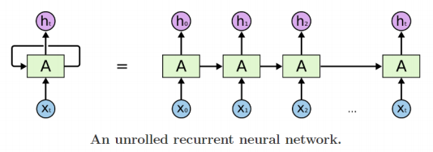

# Basics of Recurrent Neural Networks (RNNs)

## Type of RNNs
---
* ### Basic structure
    

## Recurrent Neural Network
---
* ### Inputs and outputs of RNNs (rolled version)
    * #### We usually want to predict a vector at some time steps
    

* ### How to calculate the hidden state of RNNs
    * #### We can process a sequence of vectors by applying a recurrence formula at every time step
    * $h_{t-1}$: old hidden-state vector
    * $x_t$: input vector at some time step
    * $h_t$: new hidden-state vector
    * $f_W$: RNN function with parameters W
    * $y_t$: output vector at time step t

        $h_t=f_W(h_{t-1}, x_t)$
        

    * Notice: The same function and the same set of parameters are used at every time step

        $h_t = f_W(h_{t-1}, x_t)$ 

    * The state consists of a single "hidden" vector **h**

# Types of RNNs
---
* ### One-to-one
    * Standard Neural Networks
* ### One-to-many
    * Image Captioning
* ### Many-to-one
    * Sentiment Classification
* ### Sequence-to-sequence(time delayed)
    * Machine Translation
* ### Sequence-to-sequence(on real time)
    * Video classification on frame level

# Character-level Language Model

## Character-level Language Model
---
* ### Example of training sequence "hello"
    * Vocabulary: [h, e, l, o]
    * Example training sequence: "hello"
    
    * $h_t=tanh(W_{hh}h_{t-1}+W_{xh}x_t+b)$
    
    * $\text{Logit}=W_{hy}h_t+b$
    
    * At test-time, sample characters one at a time, feed back to model
    

## Backpropagation through time (BPTT)
---
* ### Forward through entire sequence to compute loss, then backward through entire sequence to compute gradient
    
# ### Run forward and backward through chunks of the sequence instead of whole sequence
    

# Long Short-Term Memory (LSTM)

# Gated Recurrent Unit (GRU)

## Long Short-Term Memory (LSTM)
---
* ### Core Idea: pass cell state information straightly without any transformation